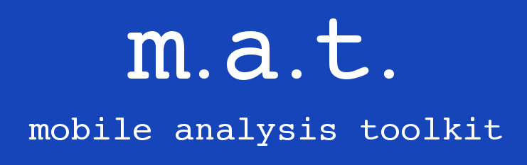

# m.a.t. - A Linux mobile analysis toolkit

## About m.a.t.

m.a.t. was born after I learned to use Saltstack, and realized that there was no singular repo (that I could find) which contained either a listing or a source for understanding and installing tools to conduct mobile forensic analysis. When I started to compile my list, I soon came to the conclusion that I must create a toolkit whereby these tools could be utilized and showcased.

The foundation for m.a.t. is a Ubuntu 18.04 or 20.04 LTS installation, either server or desktop - your choice.

## The Tools

Within this documentation you will find a set of categories for tool usage, and a list of the tools themselves, to include their original source, basic usage commands, and what they're good at.

## Methods of Usage

There are a few ways that m.a.t. can be used:

* Using a [docker](https://hub.docker.com/r/digitalsleuth/mat-distro) image
* Building your own VM with the [m.a.t. CLI](https://github.com/digitalsleuth/mat-cli)
* Installing m.a.t. into a Windows Subsystem for Linux instance

Due to the size of the installation once complete, a pre-built VM is not currently available - but it will be soon!
